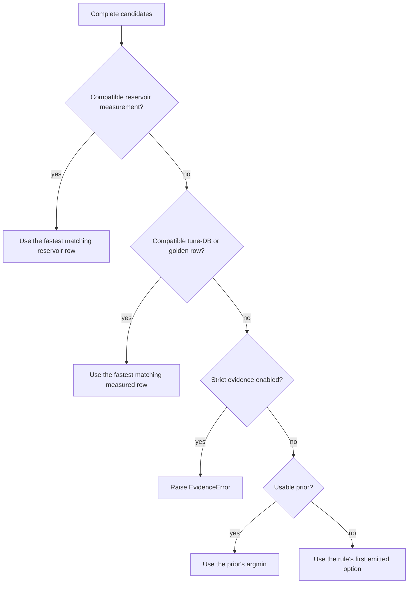
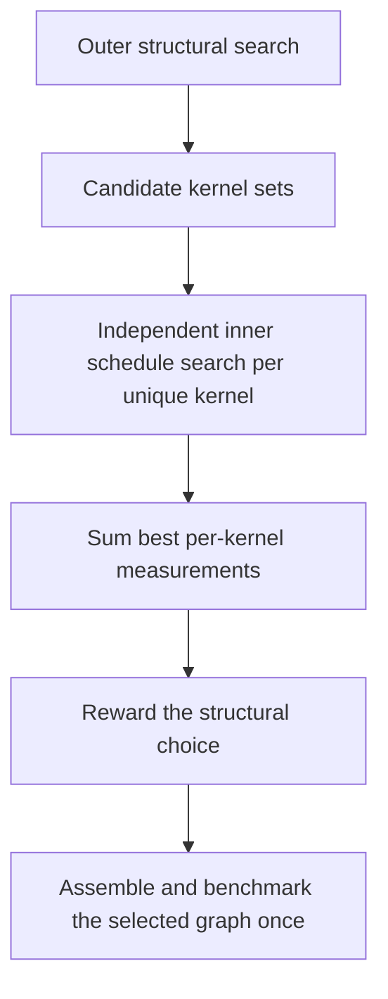
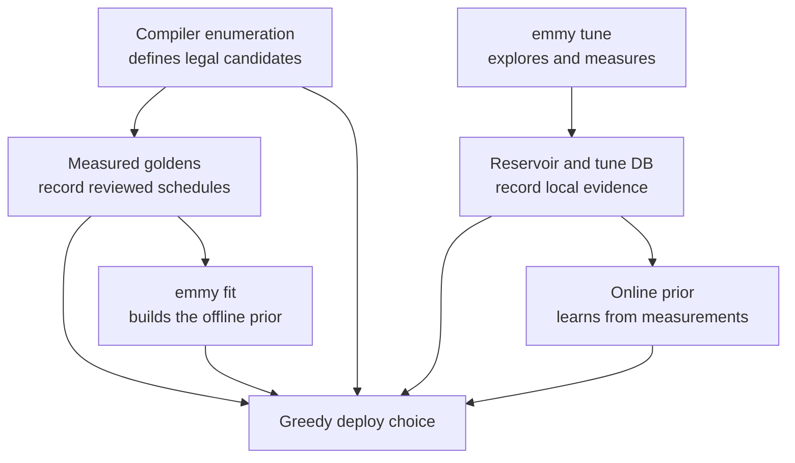

# How Emmy chooses a GPU schedule

This chapter explains how Emmy chooses among several correct ways to run the same mathematics on a GPU. These ways are
called **schedules**. A schedule decides details such as how work is divided among threads and how data moves through
GPU memory. Two schedules can return the same answer while one is much faster.

Read [From PyTorch to CUDA: Compiler Deep Dive](./compiler_deep_dive) first. If warmup, per-kernel timing, or A/B
measurements are unfamiliar, also read [Benchmarking and Comparing Emmy](./benchmarking_emmy).

:::info The central idea
An ordinary compile never benchmarks. It prefers compatible recorded measurements, then asks a prior to rank whatever
has not been measured. `emmy tune` is the separate workflow that explores, benchmarks, and records alternatives.
:::

In Emmy, **prior** does not mean a Bayesian probability distribution. It is a ranker that estimates which schedule will
be fast. A **golden configuration** is a persisted symbolic program target whose realizations record reviewed schedules
and measurements for one exact GPU platform.

By the end of this chapter, you should be able to explain:

- what a compiler fork, knob, candidate, and candidate pool are;
- the measured-evidence order and strict-evidence mode;
- how the offline and online halves of the prior are trained and composed;
- why tuning measurements always use the deployable `-O3` regime;
- how a program-backed golden joins a current compiler fork;
- why working and canonical golden files have different trust levels; and
- which evaluation command answers each kind of ranking question.

## 1. Start with one fork

A **fork** is a compiler decision point with several valid alternatives. Each alternative carries **knobs**, named
tuning choices such as work placement, tile shape, staging, or raster order. A complete realized alternative is a
**candidate**. All candidates that compute one kernel's same result form its **candidate pool**.

A candidate row has four conceptual regions:

```python
{
    # Hardware and compilation context
    "H_cc_major": 12.0,
    "H_opt": 3.0,

    # Structural identity stamped on the operation
    "S_ext_free_prod": 262144.0,
    "S_ext_reduce_max": 512.0,
    "S_dtype_f16": 2.0,

    # Decisions made while descending the fork tree
    "WORK": "w2x1",
    "TILE": "mma_m16n8k16_f16_f32/f4x4/k2",
    "STAGE": "d4/smem-async",
}
```

The exact feature set evolves, so this is illustrative rather than a stable schema.

| Prefix | Meaning | Examples |
|---|---|---|
| `H_*` | Hardware and compiler context | GPU capability and optimization settings |
| `S_*` | Structure of the operation | extents, data types, symbolic axes, operation counts |
| `D_*` | Derived geometry and interactions | tile ratios, waves, staging properties, hardware use |
| none | Tunable decisions | `WORK`, `TILE`, `STAGE`, `RASTER`, `PLACE` |

`search/features.py::knob_features` turns the row into numeric features consumed by a ranker. Forks do not carry
permanent heuristic scores: search and greedy compilation share one feature and prior boundary.

Greedy compilation compares complete rows. Partial branches are not valid prior inputs because later choices may be
needed to calculate tile area, staging depth, or occupancy. Structural forks are stricter still: a choice that changes
which kernels exist is priced by the summed cost of resolving those kernels, not by scoring the raw graph option.

## 2. The deploy evidence hierarchy

Ordinary compilation makes one greedy choice at each fork without benchmarking alternatives. Explicit hand pins
(`--ab` or `EMMY_<KNOB>`) constrain the named choices. `--golden PATH` selects a file of measured evidence; it does not
force every recorded schedule. `--realization NAME` selects an embedded program for reproduction.

For unpinned choices, `search/policy/greedy.py` uses this order:



1. **Reservoir evidence.** The online checkpoint's fastest compatible measured row that matches an offered schedule.
2. **Tune-DB and golden evidence.** The fastest compatible row in the shared evidence index. The DB's `perf` rows and
   golden rows compete on measured microseconds; a canonical golden has no separate priority. By default the golden
   rows come from the live card's repository files; `--golden PATH` replaces that scope with the named file.
3. **Prior prediction.** The trustworthy online half, or the fitted offline half during cold start or quarantine.
4. **Emission order.** If no evidence or prior decides, use the first emitted option. This is a validity fallback,
   not a performance policy. Equal scores use deterministic candidate ordering.

`--strict-evidence` refuses steps 3 and 4: an unmeasured fork raises `EvidenceError` naming the kernel. It does not
perform tuning or repair missing evidence.

All measured deploy evidence uses the deployable `-O3` regime. `emmy tune` also defaults to `-O3`, so its measurement
is the one a normal deploy can use. A deliberately different `--nvcc-flags` value creates a separate context and is
not silently read by a default compile.

### Small example — evidence beats a prediction

| Candidate | Measured on this GPU at `-O3` | Online prediction |
|---|---:|---:|
| A | 15 µs | 10 µs |
| B | 12 µs | 14 µs |
| C | not measured | 9 µs |

C has the best prediction, but B has the fastest compatible measurement, so Emmy chooses B. The model fills gaps; it
does not overrule stronger evidence.

## 3. Identities keep evidence honest

A latency matters only in the context where it was measured. Emmy uses different identities for different joins:

| Identity | Purpose |
|---|---|
| deploy identity | Selects the exact kernel for strict recorded-schedule decode, including child receipts |
| operation signature | Groups equivalent offer sites for measured evidence and training |
| context key | Separates GPU, compiler flags, fast math, and other performance regimes |
| schedule row key | Distinguishes exact realized knob alternatives |
| GPU identity | Scopes canonical goldens to the exact recorded platform |

The deploy identity is stricter than an operation name or shape. It digests the complete schedule-free Loop-IR body,
including output behavior and I/O dtypes and shapes. The record derives it through the same total Loop-to-Tile lift as
the live fork. Strict replay must decode its recorded schedule against the current compiler. Ordinary evidence
selection joins structural signatures and offered knob choices; it does not install a golden as a pin.

Measured reservoir and DB joins are deliberately tolerant of added `S_*` stamps: old evidence should not disappear
merely because the current compiler learned one more structural feature. They still require the operation, context,
and realized candidate to vouch for the same work.

## 4. The offline prior

`search/prior/offline.py::OfflinePrior` is the cold-start ranker. It owns no dataset at runtime; it loads the
repository artifact at `search/prior/offline_weights.json`. The default artifact is currently a `LinearModel`, though
the artifact format also supports a fitted CatBoost model.

The linear model scores derived `D_*` features:

```text
quality = sum(weight[feature] * feature_value) + fitted interaction terms
latency_proxy = exp(-scale * quality)
```

Lower is better. The proxy is ordinal rather than calibrated microseconds. Separate static and dynamic weights handle
the different scheduling behavior of symbolic masked tiles.

The weights are fitted, not maintained by a heuristic-generation script. `emmy fit` reconstructs each golden's
candidate pool and optimizes the same scoring object the deploy path uses:

```bash
# Fit the default linear trainer on canonical goldens into a separate run directory.
./venv/bin/emmy fit \
  --trainer linear \
  --data golden \
  --pool-sample 2000 \
  --out /tmp/emmy-linear-fit

# Fit the alternative tree trainer without replacing the checked-in artifact.
./venv/bin/emmy fit \
  --trainer catboost \
  --data golden \
  --pool-sample 2000 \
  --out /tmp/emmy-catboost-fit
```

`LinearTrainer` and `CatBoostTrainer` are immutable fit settings. Each consumes candidate pools and produces a model;
cross-validation groups by shape so related realizations do not leak across folds. A pool may contain more than one
verified answer, and ranking any accepted one first counts as success.

Use `--artifact PATH` only after reviewing the fit report and cross-validation. `EMMY_OFFLINE_FILE` or
`emmy eval prior --offline-file PATH` selects a candidate artifact for an A/B without replacing the default. Artifact
loading checks the feature-vocabulary version rather than silently applying incompatible weights.

## 5. The online prior

`search/prior/online.py::OnlinePrior` is one global CatBoost model trained from local tuning measurements. Hardware,
structure, and derived features let one model distinguish operations and GPUs instead of keeping one model per kernel.

Its target is log median latency:

```text
y = log(median latency in microseconds)
prediction_us = exp(model(features))
```

Missing features remain missing rather than becoming zero. Missing can mean a historical row predates a feature;
zero can be a real, explicit OFF decision.

One tuning loop is conceptually:

```python
prior = load_prior()

for operation in operations:
    search = start_mcts(operation, prior=prior)
    for candidate in search:
        latency_us = benchmark(lower_to_cuda(candidate))
        search.record(candidate, reward=1 / latency_us)

    prior.add_rows(value_of_position_rows(search))
    prior.maybe_refit()
    prior.checkpoint()
```

Leaves receive their measured latency. A partial tree position receives the best measured latency reachable below it,
so the online model learns the value of arriving at an incomplete decision as well as complete schedules.

The checkpoint contains the CatBoost model, bounded reservoir, counters, and calibration result. Reservoir sampling
keeps a uniform bounded sample instead of retaining only recent rows. The model refits at row-count cadences between
operations, so it does not change its opinion after every candidate inside one search trajectory.

### Promotion and quarantine

A fitted model is not automatically allowed to decide a deploy. Emmy checks the median per-operation Spearman rank
correlation between prediction and measured reservoir rows. A model that fails calibration is **quarantined**: it keeps
collecting data and checkpointing, but the offline half ranks unmeasured candidates. Reservoir measurements remain live
because direct evidence does not need a trustworthy model.

## 6. How the two priors compose

`FallbackPrior` presents one ranking surface. A named **blend**, selected by `EMMY_PRIOR_BLEND`, answers two different
questions:

- which whole half owns greedy deploy ranking; and
- how the halves influence MCTS exploration.

The default `tilt` blend uses the offline half while the online model is cold or quarantined. Once the online model is
trustworthy, online predictions own deploy ranking. During MCTS only, the online and offline policies are normalized
within the sibling set before the offline policy tilts exploration. They are not multiplied in raw units because
online scores are microseconds while offline scores are ordinal.

`gate` is the no-interaction comparison. `online` and `offline` isolate one half for experiments; they deliberately
ignore the normal trust policy and are not deployment defaults.

## 7. How MCTS and two-level tuning use the prior

MCTS treats compiler choices as a tree. Emmy's PUCT selection balances measured reward, predicted promise, and visits:

```text
Q(child) + c * P(child) * sqrt(parent_visits + 1) / (1 + child_visits)
```

- `Q` summarizes the best measured reward below a child.
- `P` is the prior's sibling-normalized policy.
- More visits reduce the exploration bonus.
- `--explore-eps` can occasionally choose a random child to perturb deterministic PUCT.

`TwoLevelStrategy` separates structural choices from per-kernel scheduling:



The outer search chooses graph-changing alternatives. Each terminal kernel set is evaluated by tuning every unique
kernel independently; identical kernels across layers or structural candidates reuse cached DB measurements. Minted
child kernels become first-class tuning targets. A measured **route row** spells a placement or cross-CTA split and
prices that structural decision. The child kernels then resolve from their own evidence; a parent row does not encode
all child schedules. A measured arm outranks arms priced by nested predictions. If every measured variant of a child
failed, that evidence can disqualify its arm.

`--gpus N` or `--devices 0,1,3` runs independent per-kernel work concurrently on homogeneous GPUs. The shared DB and
prior remain on one event loop, and each GPU has at most one in-flight benchmark.

## 8. The persistent stores

Do not treat these stores as interchangeable:

| Store | Default location | Written by | Used by |
|---|---|---|---|
| canonical goldens | recipe-local `golden/` or `search/goldens/` | reviewed promotion | measured evidence, replay, offline fit |
| reservoir and online model | `~/.cache/emmy/online.json` | `emmy tune` | measured tier, online training and prediction |
| tune DB `perf` table | `~/.cache/emmy/autotune.db` | `emmy tune`, clean pinned and greedy re-bench rows from `run --bench` | measured evidence and benchmark cache |
| tune DB `node` table | same SQLite file | `emmy tune`, pinned `run --bench` | diagnostics only, never deploy |

`EMMY_TUNE_DB` and `EMMY_ONLINE_FILE` override the mutable local paths. Only canonical goldens and the fitted offline
artifact travel with a clone.

A **measurement freeze** is a separate, fixed snapshot of node measurements used for reproducible evaluation. The
repository default is under `search/freezes/`; its manifest pins version and checksums while payload YAML is stored in
Git LFS. `EMMY_FREEZE_DIR` selects another freeze. A freeze is not the mutable tune DB, a training reservoir, or deploy
evidence.

## 9. Program-backed goldens

Golden YAML is a persistence format, not a list of shape-specific Python subclasses. A file contains:

- the exact GPU name and compute capability;
- optional model identity and quantization digest;
- stable Torch IR programs and, when needed, stable Loop IR targets;
- `configs`, each selecting one symbolic program target; and
- one or more `realizations` per configuration.

A realization records named bindings, input pins, schedule knobs, and—after verification—paired measurements:

```yaml
gpu_name: NVIDIA GeForce RTX 4080
compute_cap: [8, 9]
programs:
  - inputs: [x0, x1]
    outputs: [matmul]
    nodes: [...]  # Stable Torch IR, abbreviated here.
configs:
  - program: 0
    target:
      origins: [matmul]
    realizations:
      - name: matmul.square.512.fp16
        bindings: {}
        pins: {FAST_MATH: false}
        knobs:
          WORK: w2x1
          TILE: mma_m16n8k16_f16_f32/f1x4/k2
          RASTER: ''
          STAGE: d4/smem-async
        measurements:
          emmy_us: 8.3
          reference_us: 6.0
          reference_backend: cublas
```

Repository files are authoritative; the excerpt only illustrates the nesting. A dynamic realization remains a
symbolic program, not a static shape evaluated at one hint.

### Working versus canonical files

A **working golden file** is mutable local search state. It can contain inventory-only rows, proposed knob rows,
ranking feedback, and measured tune winners. `emmy tune --golden FILE` updates it atomically and refuses to mutate
a canonical repository golden directly.

A **canonical golden file** is reviewed per-GPU evidence. Model goldens live under
`recipes/<model>/golden/<gpu>_<capability>.yaml`; model-agnostic hardware goldens live under
`emmy/compiler/pipeline/search/goldens/`. Every realization must have verified deployable measurements.

A placement cut changes one parent into several kernels. A **child-identity schedule receipt** freezes the cut in
input pins, records one child's schedule knobs, and stores that child's deploy identity. Strict decode uses that
identity to select the child. As deployment evidence the receipt contributes a route row for the parent and a schedule
row for the child. Measured rows in a working file also participate when the command names it with `--golden PATH`;
unmeasured inventory and proposals do not.

### How a golden matches a live fork

The measured-evidence index requires compatible GPU, compile context, structural signature, and offered knob choices.
A row that cannot reach an offered arm or leaf does not settle the fork. Strict recorded-schedule decode separately
checks the persisted program and exact schedule spelling, using a child identity when the row describes a split child.

A name selects a realization for replay; it is not the evidence join. Missing usable evidence permits the prior to
rank candidates unless `--strict-evidence` is enabled. Use strict replay and the release audit to expose stale rows
rather than assuming that an ordinary compile proves every golden row remains usable.

Measured goldens serve both as deploy evidence and as the dataset for fitting the offline prior. They do not enter the
online reservoir; the online half trains on ordinary tuning measurements.

## 10. Record and replay safely

A fast number is not enough. A pinned program must realize the requested schedule, return the correct answer, and
report plausible timing. Use an existing golden or a working golden rather than manually constructing a partial row:

```bash
# Replay one named canonical realization.
./venv/bin/emmy run \
  --realization matmul.square.512.fp16 \
  --bench --warmup 5 --iters 20 \
  --json /tmp/emmy-golden-replay.json

# Tune all targets in a mutable working file.
EMMY_TUNE_DB=/tmp/emmy-golden-course.db \
  ./venv/bin/emmy tune \
  --golden /tmp/model-working.golden.yaml \
  --patience 8
```

Pinned A/B rows have three essential gates:

1. the requested knobs must be realized exactly;
2. timing must remain physically plausible for the operation and hardware; and
3. the result must agree with the reference computation.

A failed or hung kernel is `bench_fail`; a rejected pin is `pin_unmatched` and is not benchmarked. Copy the complete
`record_knobs` map when promoting evidence, including explicit OFF families, so a future scheduler cannot silently fill
an omitted family differently. Compare a pin with `greedy (isolated)`, which uses the same measurement path, rather
than with a differently orchestrated ordinary benchmark row.

Canonical promotion is part of model qualification and requires the exact target GPU. Checked-in model goldens are
validated by the nightly onboarding workflow, not by the per-commit test suite.

## 11. Evaluate the right layer

The current `emmy eval` surface is:

```bash
# Knob schema and measured interactions.
./venv/bin/emmy eval knobs

# Rank both prior halves on canonical goldens.
./venv/bin/emmy eval prior --dataset golden --pool-sample 2000

# Reproducible evaluation on the repository measurement freeze.
./venv/bin/emmy eval prior --dataset nodes

# Inspect this machine's measured variants and failures.
./venv/bin/emmy eval variants --db /tmp/emmy-golden-course.db
./venv/bin/emmy eval failures --db /tmp/emmy-golden-course.db
```

`emmy eval golden` is now a file-scoped release audit, not a name-only rank report. It validates one canonical golden
against the pinned serving configuration, exact live GPU, model provenance, realization coverage, and schedule decode.
It then compiles the serving twins with the file's rows as the sole evidence: every reachable fork must be decided
without a prior prediction or local DB/reservoir measurements:

```bash
./venv/bin/emmy eval golden \
  --golden recipes/MODEL/golden/GPU.yaml \
  --serving-config recipes/MODEL/model.env
```

Use the exact paths named by a real model release configuration; the placeholders above are deliberately not runnable.

Candidate prior artifacts can be compared without replacing defaults:

```bash
./venv/bin/emmy eval prior \
  --dataset golden \
  --offline-file /tmp/candidate-offline.json \
  --online-file /tmp/candidate-online.json \
  --json /tmp/candidate-prior-report.json
```

Important diagnostics include:

- **regret**: the selected candidate's measured latency divided by the best measured latency;
- **rank correlation**: how closely a model's full ordering follows measurements; and
- **golden rank**: where a verified realization lands inside its candidate pool.

These answer different questions. A model can have acceptable average ordering while making a costly top-one mistake,
which regret exposes.

## 12. Failure modes

| Symptom | Likely boundary | First inspection |
|---|---|---|
| golden identity matches but no leaf decodes | enumeration drift | exact schedule row and compiler vocabulary |
| fitted online model does not own ranking | calibration quarantine | `emmy eval prior`, checkpoint calibration |
| known tune result is not deployed | operation/context/evidence join | `H_opt`, context key, evidence logs |
| placement parent appears to be ignored | structural evidence contract | route-row spelling and child schedule evidence |
| candidate looks impossibly fast | measurement integrity | plausibility flag, launch grouping, correctness |
| predictions collapse after compiler change | vocabulary drift | feature version and artifact/checkpoint load |
| two reported prior runs disagree | mutable dataset drift | use the same measurement freeze and pool sample |
| offline score is read as microseconds | unit misunderstanding | compare its ordering, not absolute magnitude |

## 13. Code-reading path

Read these entry points in order:

1. `emmy/compiler/pipeline/search/space.py`: knob declarations and grids.
2. `emmy/compiler/pipeline/search/features.py`: the shared feature boundary.
3. `emmy/compiler/pipeline/search/policy/greedy.py`: deploy evidence hierarchy and deterministic ties.
4. `emmy/compiler/pipeline/search/prior/offline.py` and `linear_model.py`: cold ranking.
5. `emmy/compiler/pipeline/search/prior/online.py`: learned ranking and reservoir persistence.
6. `emmy/compiler/pipeline/search/prior/blend.py` and `fallback.py`: promotion and composition.
7. `emmy/compiler/pipeline/search/policy/mcts.py`: PUCT selection and propagation.
8. `emmy/compiler/pipeline/search/strategy/two_level.py`: structural and per-kernel search.
9. `emmy/compiler/pipeline/search/db.py`: `perf` and `node` persistence.
10. `emmy/compiler/pipeline/search/golden.py` and `working_golden.py`: canonical and mutable schemas.
11. `emmy/compiler/pipeline/search/data/freeze.py`: reproducible measurement snapshots.
12. `emmy/commands/fit.py`, `tune.py`, `run.py`, and `eval.py`: user-facing drivers.

Keep `emmy/compiler/pipeline/ARCHITECTURE.md` open beside the code. It is the authoritative reference for the exact
evidence order, structural pricing, golden promotion, and tuning workflow.

## 14. Labs

### Lab A — CPU-only policy tests

```bash
./venv/bin/pytest \
  tests/compiler/pipeline/search/policy/test_greedy.py \
  tests/compiler/pipeline/search/prior/test_score_rows.py \
  tests/compiler/pipeline/search/prior/test_prior_fit.py \
  tests/compiler/pipeline/search/data/test_freeze.py \
  tests/compiler/pipeline/search/test_two_level_strategy.py -q
```

For each test, identify whether it protects strict schedule decode, measured evidence, prediction, fitting, frozen
evaluation, or structural search.

### Lab B — inspect the shipped prior and goldens

```bash
./venv/bin/emmy eval knobs
./venv/bin/emmy eval prior --dataset golden --pool-sample 2000
rg -n "^gpu_name:|^configs:|  realizations:|    measurements:" \
  emmy/compiler/pipeline/search/goldens
```

Choose one small hardware golden and trace its program, target selector, realization, schedule row, and measurements.

### Lab C — isolated caches on a GPU

```bash
EMMY_TUNE_DB=/tmp/emmy-prior-course.db \
EMMY_ONLINE_FILE=/tmp/emmy-prior-course.json \
  ./venv/bin/emmy tune \
  -c "nn.RMSNorm(256)(torch.randn(4,256,device='cuda',dtype=torch.float16))" \
  --patience 8
```

Then inspect the local stores:

```bash
./venv/bin/emmy eval variants --db /tmp/emmy-prior-course.db
./venv/bin/emmy eval prior --dataset nodes --db /tmp/emmy-prior-course.db \
  --online-file /tmp/emmy-prior-course.json
```

The online model may remain below its fit threshold after a small tune. Compatible measurements can still decide
candidates while the offline half ranks unmeasured rows.

## 15. Safe change recipes

### Add a feature

1. Define it at the shared feature boundary and test missing, zero, and realized states.
2. Decide whether it is hardware/context (`H_*`), structure (`S_*`), or derived geometry (`D_*`).
3. Bump the feature version if persisted interpretation changes.
4. Refit candidate offline artifacts with `emmy fit`; compare identical datasets and pool samples.
5. Confirm incompatible online checkpoints and freezes fail explicitly.
6. Run prior, greedy-evidence, and frozen-dataset tests.

### Add or change a knob

1. Register the family and canonical parser.
2. Ensure every complete leaf stamps it, including explicit OFF.
3. Preserve missing-as-undecided semantics where partial rows exist.
4. Test exact schedule-row decode and deterministic tie-breaking.
5. Reproduce affected canonical goldens; never weaken drift checks to make an old row pass.

### Promote a canonical golden

1. Start from a working golden inventory for the exact program and GPU.
2. Tune and benchmark every required realization at deployable `-O3`.
3. Reject pin mismatches, failures, wrong answers, and implausible timings.
4. Preserve complete knobs, pins, bindings, program/Loop IR, and paired reference measurements.
5. Preserve route rows and child-identity schedule receipts for schedules behind placement cuts.
6. Run the file-scoped `emmy eval golden` release audit with the pinned serving configuration.
7. Re-run the relevant model qualification workflow on the exact target GPU.

## Final mental model



A golden does not bypass the compiler: its measured rows must still match offered choices for the same work, GPU,
and pin regime. Strict replay additionally checks the exact recorded schedule. The online model does not replace
measurement; it ranks gaps between observations. The offline model provides a fitted cold-start order. If every layer
is silent, emission order is only a last resort.
