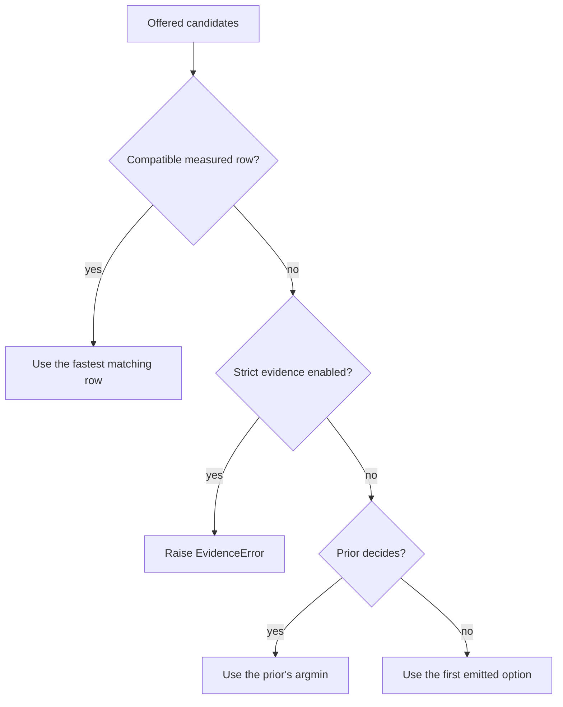

# How Emmy chooses a GPU schedule

This chapter explains how Emmy chooses among several correct ways to run the same mathematics on a GPU. These ways are
called **schedules**. A schedule decides how work is divided among threads and how data moves through GPU memory. Two
schedules can return the same answer while one is much faster.

Read [From PyTorch to CUDA: Compiler Deep Dive](./compiler_deep_dive) first. If warmup, per-kernel timing, or A/B
measurements are unfamiliar, also read [Benchmarking and Comparing Emmy](./benchmarking_emmy).

:::info The central idea
An ordinary compile never benchmarks. It prefers compatible recorded measurements, then uses a fitted offline prior
where no measurement decides. `emmy run --bench` records new evidence. There is currently no `emmy tune` command or
online-prior training loop.
:::

By the end of this chapter, you should be able to explain:

- how a fork exposes valid alternatives and a knob names one choice;
- why measured evidence wins over a prediction;
- how routing rows price a choice that changes the kernel set;
- how golden files become deployment evidence;
- how an exported dataset feeds offline fitting and evaluation; and
- which checks establish that a recorded schedule still realizes.

## 1. Start with one fork

A **fork** is a compiler decision point with several valid alternatives. Each alternative carries **knobs**, named
choices such as work placement, tile shape, staging, or raster order. A complete realized alternative is a
**candidate**. All candidates for one kernel form its **candidate pool**.

A candidate row has three conceptual regions:

```python
{
    # Hardware and compilation context
    "H_cc_major": 12.0,
    "H_opt": 3.0,

    # Structure of the operation
    "S_ext_free_prod": 262144.0,
    "S_ext_reduce_max": 512.0,
    "S_dtype_f16": 2.0,

    # Complete schedule choices
    "WORK": "w2x1",
    "TILE": "mma_m16n8k16_f16_f32/f4x4/k2",
    "STAGE": "d4/smem-async",
}
```

This illustrates the feature families, not a stable schema or a pin to copy. `search/features.py::knob_features`
derives numeric features from the row:

| Prefix | Meaning | Examples |
|---|---|---|
| `H_*` | Hardware and compiler context | GPU capability and optimization settings |
| `S_*` | Structure of the operation | extents, data types, symbolic axes, operation counts |
| `D_*` | Derived geometry and interactions | tile ratios, waves, staging properties, hardware use |
| none | Tunable decisions | `WORK`, `TILE`, `STAGE`, `RASTER`, `PLACE` |

The prior ranks complete schedule rows. Partial branches may lack the choices needed to calculate geometry or resource
use. Large unmeasured pools use a bounded deterministic sample of complete rows. Direct measured evidence can descend
to its offered row without enumerating the whole pool.

## 2. The deploy evidence hierarchy

For an unpinned choice, the order is:


```mermaid
flowchart TB
    Start[Offered candidates] --> Index{Compatible measured row?}
    Index -->|yes| PickM[Use the fastest matching row]
    Index -->|no| Strict{Strict evidence enabled?}
    Strict -->|yes| Error[Raise EvidenceError]
    Strict -->|no| P{Prior decides?}
    P -->|yes| PickP[Use the prior's argmin]
    P -->|no| First[Use the first emitted option]
```

1. **Measured evidence.** The tune DB's compatible `perf` rows, including the golden rows imported into it, compete on
   latency. Repository goldens are scoped to the live GPU; `--golden PATH` replaces that golden scope with one file.
2. **Offline prior.** A model fitted ahead of time ranks the candidates when no measurement decides.
3. **Emission order.** If neither evidence nor the prior decides, the rule's first emitted option is the fallback.
   Enumeration order is not a performance policy. Equal scored candidates use deterministic row ordering.

`--strict-evidence` rejects a fork that would need steps 2 or 3. It does not benchmark or repair missing evidence.
Hand pins from `--ab` or `EMMY_<KNOB>` constrain the choice explicitly; selecting a golden file is not a blanket pin.

Deployment measurements use the deployable `-O3` regime and compatible precision pins. A benchmark taken with custom
compiler flags has a separate context and cannot silently decide a compile in another regime.

### Small example — evidence beats a prediction

| Candidate | Measured latency | Prior rank |
|---|---:|---:|
| A | 15 µs | 2 |
| B | 12 µs | 3 |
| C | unmeasured | 1 |

B wins because it has the fastest compatible measurement. The prior does not overrule it merely because C has a
better predicted rank. Measuring C is a separate experiment.

## 3. Identities and structural choices

A measurement must describe the same work as the live candidate. Kernel identity includes the schedule-free Loop IR
and typed buffer roles. Context separates hardware and compiler settings. The schedule row records the exact choices.
A name is useful for selecting a realization to replay; it is not a substitute for those evidence joins.

A **structural fork** changes which kernels exist. Comparing one parent with two child kernels requires a whole-set
cost. The tune DB's **routing table** links a decision to the pieces it produces. Its measured price is the sum of the
pieces' fastest compatible measurements. Every piece must be measured for the decision to receive a measured price.

A routing row's own aggregate timing is not the price used to elect that route. The child measurements supply that
price, and each child chooses its schedule from its own evidence. With no measured decision, the compiler compares
kernel-set costs using measurements where available and prior estimates for the remaining pieces.

## 4. The offline prior

`search/prior/offline.py::OfflinePrior` loads the repository artifact at `search/prior/weights/offline.json`. It does
not load a training dataset during compilation or learn from a compile. The artifact can hold a `LinearModel` or a
`CatBoostModel`; `emmy fit --trainer linear` and `--trainer catboost` select their respective trainers.

The linear model scores derived features with fitted weights and interaction terms:

```text
quality = weighted features + fitted interaction terms
latency_proxy = exp(-scale * quality)
```

Lower is better. The proxy supplies an ordering, not calibrated microseconds. The model has separate static and
dynamic weights. CatBoost instead uses a fitted tree ranker. Both are offline models behind the same ranking interface.

A trainer is an immutable set of fit settings. Fitting produces a model without changing those settings.
Cross-validation groups by shape so related realizations cannot leak across folds. Artifact loading checks the feature
vocabulary version; incompatible weights must be refitted.

## 5. The stores and their readers

| Store | Written by | Read by |
|---|---|---|
| Working golden JSON | `emmy trace`, then `run --bench --record` or `--record-greedy` | explicit replay and the named golden evidence scope |
| Canonical golden JSON | reviewed promotion after qualification | per-card compile evidence, strict decode, dataset import |
| Tune DB | clean benchmark rows and golden import | greedy compilation and benchmark reuse |
| Dataset DB | `emmy db import --db PATH SOURCES...` | export, freeze, and consistency checks |
| Exported dataset | `emmy db export --db PATH DIRECTORY` | `emmy fit` and `emmy eval prior` |
| Offline weights | `emmy fit DATASET WEIGHTS` | prior prediction during compilation |

The tune DB defaults to `~/.cache/emmy/autotune.db`; `EMMY_TUNE_DB` selects another file. It stores kernels, contexts,
schedules, routing, and per-kernel performance. The former `node` table and online-prior checkpoint are gone.

The **dataset DB** has the same table schema in a separate file. Every database command names it explicitly; importing
training data never changes the default deployment cache. The **dataset** is a directory containing a manifest and
one matrix file per pool. Fitting and evaluation read that directory, not a live database.

A **measurement freeze** snapshots admitted measurements as JSON golden files, one per GPU. It preserves kernel
structure, schedule rows, regimes, and measurements. Import re-lowers kernels from their definitions. No repository
freeze is currently checked in; sources are always named explicitly.

## 6. Fit and evaluate from one dataset

The full hardware-golden workflow runs without a GPU, but enumeration and fitting are longer offline jobs. Use a small
source and pool sample for a first lab; use the documented full set for an actual refit.

```bash
# Import exactly the hardware goldens into a separate dataset DB.
./venv/bin/emmy db import --db _data/course.db --fresh \
  emmy/compiler/pipeline/search/golden/records/*.json

# Freeze the candidate pools used by both fitting and evaluation.
./venv/bin/emmy db export --db _data/course.db _data/course-dataset

# Write a candidate artifact rather than overwriting the shipped weights.
./venv/bin/emmy fit _data/course-dataset _data/course-offline.json

# Compare the shipped and candidate models over the same exported pools.
./venv/bin/emmy eval prior _data/course-dataset
./venv/bin/emmy eval prior _data/course-dataset --offline-file _data/course-offline.json
```

`--pool-sample` belongs to `db export`. The export records its sampling provenance, so two models can score identical
candidate pools. To fit the tree trainer, add `--trainer catboost` to the fit command. `--out` selects the fit's metrics
directory; the positional `WEIGHTS` argument selects the artifact to write.

The default evaluation scores golden pools and also checks the greedy tile-stage choice for matmul pools. That extra
compile can take longer than scoring the exported matrices. Use `--kernel SUBSTRING` to narrow it, and `--json PATH`
to save the ranking report.

:::note Measured-pool reporting at this revision
The CLI exposes `--pools measured`, but its report renderer currently raises `KeyError: 'measured'`. The data export
and offline fit work; the measured-pool CLI report needs a code fix before it can be used as a lab.
:::

Three metrics answer different questions:

- **Golden rank:** where a recorded schedule lands among the candidates its kernel offers. It does not measure the
  speed of unmeasured alternatives.
- **Regret:** the selected candidate's measured latency divided by the best available measured latency.
- **Rank correlation:** how closely the model's full ordering follows measured latency.

Use `EMMY_OFFLINE_FILE` to try an artifact during compilation. Re-export and refit after a feature-version change.

## 7. Program-backed goldens

A golden is a JSON document containing an exact GPU identity, stable program and Loop IR pools, and configurations
whose targets reference those pools. Each configuration carries named realizations with bindings, input pins,
schedule knobs, and measurements when verified.

This is an abbreviated configuration object; `program` and `target.loop` index the containing file's pools:

```json
{
  "program": 0,
  "target": {"loop": 0, "origins": ["matmul"]},
  "realizations": [{
    "name": "matmul.square.512",
    "bindings": {},
    "pins": {"FAST_MATH": false},
    "knobs": {"WORK": "w2x1", "TILE": "mma_m16n8k16_f16_f32/f1x4/k2", "RASTER": "", "STAGE": "d4/smem-async"},
    "measurements": {"emmy_us": 8.3, "reference_us": 6.0, "reference_backend": "cublas"}
  }]
}
```

The numbers illustrate the nesting; use repository records for actual measured evidence. Model goldens live at
`recipes/<model>/golden/<gpu-slug>_<compute-cap>.json`. Hardware goldens live under
`emmy/compiler/pipeline/search/golden/records/`.

A **working golden** may contain unmeasured inventory and proposed schedules. Only measured rows are evidence.
A **canonical golden** contains reviewed evidence; recording commands refuse canonical destinations, so work on a copy.

A **child-identity schedule receipt** stores one child kernel's identity and schedule. `--record-greedy` writes those
receipts under the seed's input regime, with separate routing rows and a `kernel_set` listing describing the decisions.
Do not copy a parent's cut pins onto every child: a same-spelled seam can mean something different inside that child.
Realization corpus cases may deliberately pin the route to reproduce a specific gap.

## 8. Record and replay safely

Begin with a small inventory on the intended GPU. Use a new filename because tracing refuses an existing destination:

```bash
./venv/bin/emmy trace \
  --code "nn.RMSNorm(256)(torch.randn(4, 256, device='cuda', dtype=torch.float16))" \
  --output /tmp/course-rmsnorm.golden.json

# Record the selected kernel set and its per-kernel measurements.
EMMY_TUNE_DB=/tmp/course-tune.db ./venv/bin/emmy run \
  --golden /tmp/course-rmsnorm.golden.json --realization rms_norm \
  --bench --strict --warmup 5 --iters 20 --record-greedy \
  --json /tmp/course-rmsnorm.json
```

Read the inventory's realization names before selecting one. `--record` writes measurements for replayed rows;
`--record-greedy` records the selected kernel set. `--pin-route` asks a greedy recording to replay the file's stored
route. The whole-file benchmark walks targets and benches verified pinned rows; an explicitly selected realization
can also be an unmeasured proposal.

To compare another schedule, use `run --bench --ab` with a complete valid knob row. Require:

1. the requested knobs to realize;
2. correctness against the available reference;
3. physically plausible timing; and
4. a repeated measurement in the same regime.

Read the JSON status, reference, integrity flags, and `record_knobs`. Compare pinned rows with the isolated greedy row,
which uses the same timing path. Whole-program latency and a sum of isolated kernel latencies answer different questions.
Clean measurements also reach the tune DB by default; `--no-record-evidence` disables that automatic recording.

## 9. Check drift and qualify releases

The default test suite strictly decodes every repository golden row, including recipe-local model goldens, without a
GPU. It also checks whether each golden's stored targets still match a fresh lowering of its own programs.

```bash
# CPU-only: check one small hardware golden.
./venv/bin/emmy golden check emmy/compiler/pipeline/search/golden/records/rtx4080_sm89.json

# Inspect the stored Loop IR targets.
./venv/bin/emmy golden kernels emmy/compiler/pipeline/search/golden/records/rtx4080_sm89.json
```

`emmy golden restamp PATH` updates stale targets and row identities without a GPU. A changed rendered kernel loses
its old timing and becomes a proposal; a row that no longer decodes is dropped. Restamping does not establish new
performance evidence. A measured regression needs investigation before any re-recording.

For a serving release, `emmy eval golden --golden FILE --serving-config FILE` requires the exact live GPU. It checks
model provenance, realization coverage, and strict schedule decode, then compiles the serving matrix with that file
as the sole measured evidence. Local measurements and prior predictions cannot hide a gap. Exact-GPU model
qualification remains necessary after the CPU checks.

## 10. Failure modes

| Symptom | First inspection |
|---|---|
| A row no longer decodes | exact schedule spelling and the options currently offered |
| Stored targets differ from current lowering | `emmy golden check`; restamp after reviewing the compiler change |
| A known measurement is not deployed | kernel identity, hardware, precision regime, flags, and evidence scope |
| A recorded route is not selected | whether every child has compatible schedule measurements |
| A candidate looks impossibly fast | plausibility and correctness flags, reference, launch grouping |
| A prior artifact is rejected | feature version; re-export the dataset and refit |
| Two ranking reports disagree | dataset identity, export sampling provenance, weights, and pool selection |
| Offline scores are treated as microseconds | use their ordering; the proxy is not a calibrated latency |

## 11. Code-reading path and CPU lab

Read the pipeline architecture beside these entry points:

1. `emmy/compiler/pipeline/search/space.py` and `features.py`: knob vocabulary and numeric features.
2. `emmy/compiler/pipeline/search/policy/greedy.py`: measured selection and structural pricing.
3. `emmy/compiler/pipeline/search/prior/offline.py`: the fitted ranker used by a compile.
4. `emmy/compiler/pipeline/search/db/`: persistence, import, freeze, and dataset export.
5. `emmy/compiler/pipeline/search/dataset/`: the exported pools fitting and evaluation read.
6. `emmy/compiler/pipeline/search/golden/`: format, strict decode, evidence import, and repository scope.
7. `emmy/compiler/pipeline/search/working_golden.py`: tracing inventories and writing measured rows.
8. `emmy/commands/run.py`, `db.py`, `fit.py`, and `eval.py`: CLI entry points.

Start with these focused policy tests:

```bash
./venv/bin/pytest \
  tests/compiler/pipeline/search/policy/test_greedy.py::test_schedule_pick_descends_directly_to_complete_measured_row \
  tests/compiler/pipeline/search/policy/test_greedy.py::test_strict_evidence_refuses_a_fork_no_measurement_decides \
  tests/compiler/pipeline/search/db/test_freeze.py::test_reason_drops_a_non_deployable_regime -q
```

Explain which boundary each test protects before reading its assertions. For a feature change, update the feature
contract, export and fit a fresh dataset when required, and compare models on identical pools. For a knob change,
test exact decoding, pins, deterministic ties, and affected golden rows. Never weaken drift checks to make stale
evidence pass.

## Checkpoint

Draw the path from a benchmark to the next compile: measured kernel rows enter the tune DB, reviewed golden rows join
that same evidence, and the fastest compatible offered row wins. Then draw the separate fitting path: explicit imports
fill a dataset DB, export fixes the pools, and fitting produces the prior used only where no measurement decides.
